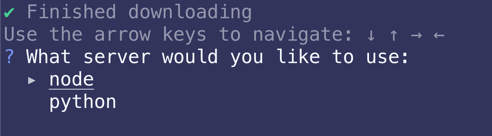
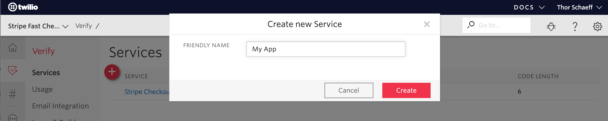
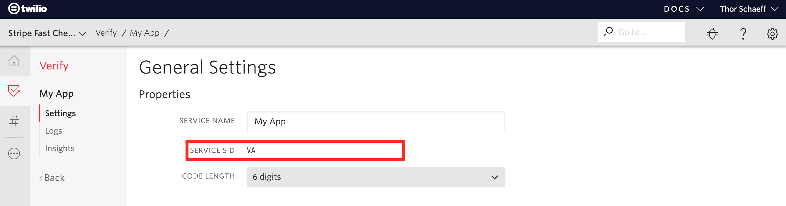

# Authenticating your returning customers with Twilio Verify

Stripe and Twilio have teamed up to build a sample application that shows you how to securely collect and store payment details from your customers, and use Twilio Verify to send returning customers an authentication code before charging their saved card details.

## Demo and resources

- [View the demo](https://ldmsw.sse.codesandbox.io/)
- [Fork the demo on CodeSandbox](https://codesandbox.io/s/github/stripe-samples/checkout-remember-me-with-twilio-verify/tree/codesandbox)
- View the sample on the [Twilio CodeExchange]()

If you prefer to watch this tutorial, you can find a recording of how to set up the sample application on the Stripe Developers YouTube channel:

[](https://www.youtube.com/watch?v=gjh5gOalYcM)

## Running the sample on your local machine

The sample application comes with two backend implementations one in JavaScript (Node) and one in Python (Flask). In this tutorial we outline how to set up the Node.js backend. You can find instructions for running the Python Flask server [here](https://github.com/stripe-samples/checkout-remember-me-with-twilio-verify/blob/master/server/python).

### Creating the sample with the Stripe CLI

The most convenient way to set up a Stripe Sample is using the Stripe CLI. Follow [these instructions](https://stripe.com/docs/stripe-cli#install) to install the CLI.

Next, you will need to be logged in to your Stripe account. If you don't have one you can register [here](https://dashboard.stripe.com/register). When logged in, run:

```bash
stripe login
```

Follow the steps to authenticate the CLI with your account.

Next, create the sample and when prompted select the `node` backend:

```bash
stripe samples create checkout-remember-me-with-twilio-verify
```



Next, navigate into the newly created smaple folder and install the dependencies:

```bash
cd checkout-remember-me-with-twilio-verify/server
npm install
```

### Setting up the environment variables

> **_NOTE_**: All values in the `.env` file except for the `STRIPE_PUBLISHABLE_KEY` must be kept secret. Therefore always double check that you're not committing the `.env` file to git!

The Stripe CLI has automatically set up a `.env` file for you, including your test API keys. Open up the `.env` file and add the following Twilio identifiers:

| Variable             | Meaning                                                                   |
| :------------------- | :------------------------------------------------------------------------ |
| `ACCOUNT_SID`        | Find in the Twilio [console](https://www.twilio.com/console)              |
| `AUTH_TOKEN`         | Find in the Twilio [console](https://www.twilio.com/console)              |
| `VERIFY_SERVICE_SID` | Create a [Verify Service](https://www.twilio.com/console/verify/services) |

You will need to create a new Twilio Verify service on the [Twilio Console](https://www.twilio.com/console/verify/services).



You can find your Verify SID in the general settings:



With all environment variables set, you can now start up the local server:

```bash
npm start
```

That's it, the appication is now running on http://localhost:4242/ 🎉

## A look at the source code

### Setting up an international phone number input field

To offer a country selector and client-side phone number formatting and validation we're using the open-source library [intl-tel-input](https://github.com/jackocnr/intl-tel-input).

```js
// client/script.js

// Format phone number input field
const phoneInputField = document.querySelector('#phone');
const phoneInput = window.intlTelInput(phoneInputField, {
  separateDialCode: true,
  utilsScript: 'build/js/utils.js',
});
// Validate input
phoneInput.isValidNumber();
// Format input
phoneInput.getNumber();
```

Validating the input client-side allows us to minimise requests to our server and provide faster feedback to our users, resulting in a better user experience.

### Look up the phone number on the server

While client-side validation is crucial, it is not sufficient, therefore we can make an [API request to look up](https://www.twilio.com/docs/lookup/api) the phone number on our server also.

```js
// server/server.js

try {
  // Validate the phone number input
  const number = await client.lookups.phoneNumbers(phone).fetch();
  number.phoneNumber; // Is valid number
} catch (error) {
  // Not a valid number
}
```

### Collect and store the customer's payment details

To securely collect the customer's payment details we're using Stripe Checkout in [setup mode](https://stripe.com/docs/payments/checkout/collecting#create):

```js
// server/server.js

// Create a new customer object
const customer = await stripe.customers.create({
  phone: number.phoneNumber,
  email,
});

// Create a CheckoutSession to set up our payment methods recurring usage
const checkoutSession = await stripe.checkout.sessions.create({
  payment_method_types: ['card'],
  mode: 'setup',
  customer: customer.id,
  success_url: `${req.headers.origin}?session_id={CHECKOUT_SESSION_ID}`,
  cancel_url: `${req.headers.origin}/`,
});
```

Using the resulting checkout session ID, we redirect the customer to the Stripe hosted payment form:

```js
// client/script.js

// Recirect to Checkout
await stripe.redirectToCheckout({ sessionId: checkoutSession.id });
```

Stripe Checkout will validate the inputted card details and attach them to the customer object if valid. Afterwards, the customer is redirected back to our application where we can now make use of their stored card details.

### Send the verification code

When charging stored payment details we need to make sure that our customer is authenticated and therefore allowed to charge their card. In this example we're using [Twilio Verify]() to send them a verification code to their phone number to authenticate them.

Twilio Verify does all of the heavy lifting here for us, namely:

- Send from a globally recognised short code
- Use a message template that is white-listed by carriers globally
- Generate a random verification code and manage its expiry

This snippets generates and send the code to our customer:

```js
// server/server.js

// Start Twilio verify
const verification = await client.verify
  .services(process.env.VERIFY_SERVICE_SID)
  .verifications.create({ to: customer.phone, channel: 'sms' });
```

### Check the verification code

Next, we take the code the customer inputted in our application and check it with Twilio:

```js
// server/server.js

try {
  // Check Twilio verify code
  const verificationCheck = await client.verify
    .services(process.env.VERIFY_SERVICE_SID)
    .verificationChecks.create({ to: customer.phone, code });

  // Check the status
  if (verificationCheck.status === 'approved') {
    // Verification code is valid
  }
} catch (error) {
  // Incorrect code
}
```

### Charge the customer

Now that we've authenticated the customer, we can charge their stored card details:

```js
// server/server.js

// Charge the stored method
const paymentIntent = await stripe.paymentIntents.create({
  amount,
  currency,
  customer: customerId,
  payment_method: paymentMethods.data[0].id,
  off_session: false, // Customer is on-session during checkout
  confirm: true, // Confirm and charge payment immediately
});
```

### Listen to Stripe webhook events

To help you test webhooks the Stripe CLI can forward webhook events to your server running locally. In a separate terminal window run:

```bash
stripe listen --forward-to localhost:4242/webhook
```

You will now see events logged in the terminal where the CLI is running and webhook events are forward to the `/webhook` route of your local server.

## Questions ?

We hope you found this tutorial helpful ❤️ If you have any feedback or questions you can reach the authors on Twitter:

- [Kelley Robinson, Developer Evangelist @Twilio](https://twitter.com/kelleyrobinson)
- [Thor 雷神, Developer Advocate @Stripe](https://twitter.com/thorwebdev)
